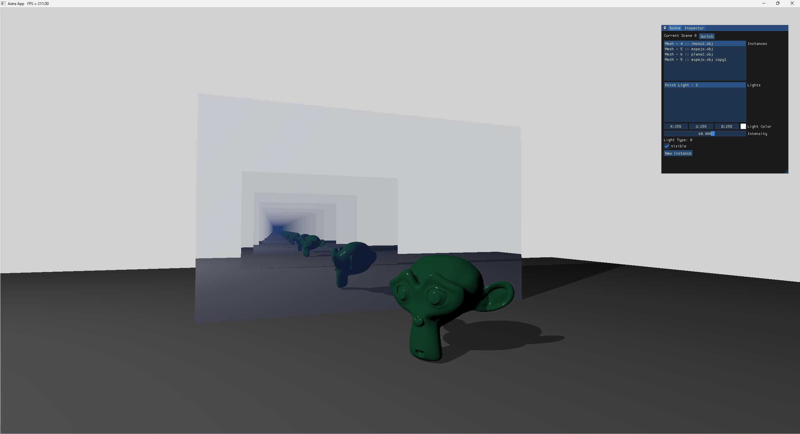
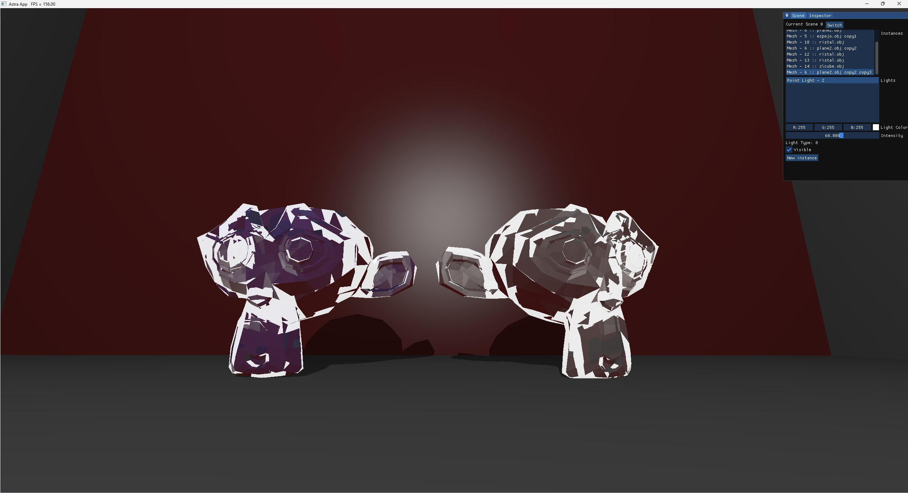
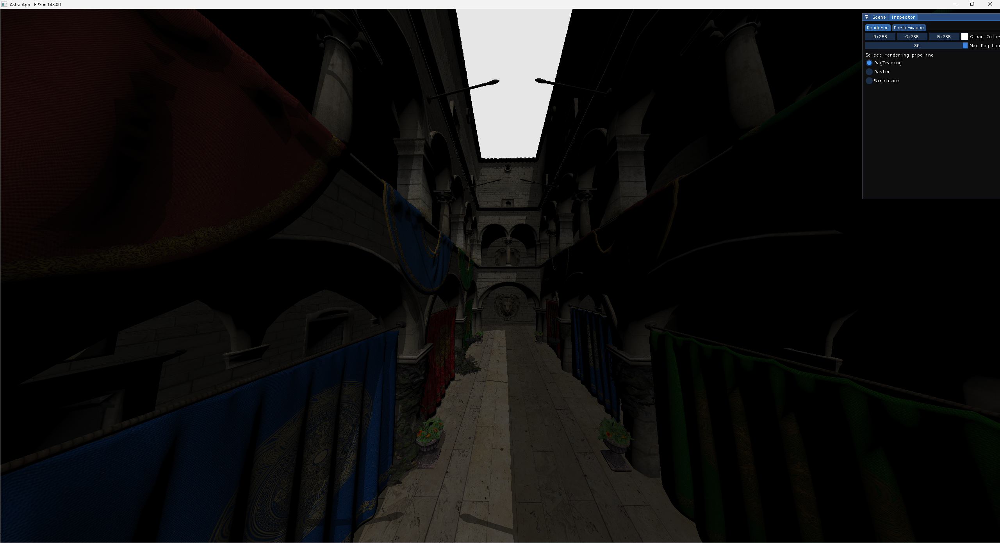

# Astra Core

> [!WARNING]  
> This is currently a work in progress and is not intented for final use.

Astra Core is a C++  library to develop visualization apps in Vulkan using rasterization or hardware-accelerated ray-tracing. However, development is currently focused on ray-tracing.

It helps you create interactive graphical applications without the hassle of working with Vulkan.

It depends on the nvpro_core library. This dependency should be removed sometime in the future. 

This repository includes the core library wich is used as a dependency in projects that use it. To see some examples check out the [examples repository](https://github.com/PinGunter/AstraExamples).

You can check the API reference [here](https://pingunter.github.io/AstraEngine)

It currently supports ray-traced shadows, reflections and refraction.

#### Screenshots

Reflections:

Refraction:

And the classic Sponza Palace:

#### Future development

Aside from improving on the library itself (better quality code, improved Vulkan abstractions, etc.). Some of the future goals include:

* [ ] Pathtracer (at least a simple one)

* [ ] Game example

* [ ] Async obj loader
- [ ] Scene graph support

- [ ] FPS Camera

- [x] Multiple colored lights
